# PSoC&trade; 4: MSCLP CAPSENSE&trade; low-power proximity tuning

This code example demonstrates an implementation of a low-power proximity sensing application for maximum proximity target sensing (a hand). It includes recommended power states and transitions, adjustments for tuning parameters, and the method of tuning. This example uses a proximity widget in CAPSENSE&trade; low-power (MSCLP - 5th-generation low-power CAPSENSE&trade;) to demonstrate a low-power design.

[View this README on GitHub.](https://github.com/Infineon/mtb-example-psoc4-msclp-low-power-proximity-rgbled)

[Provide feedback on this code example.](https://cypress.co1.qualtrics.com/jfe/form/SV_1NTns53sK2yiljn?Q_EED=eyJVbmlxdWUgRG9jIElkIjoiQ0UyMzYwMzMiLCJTcGVjIE51bWJlciI6IjAwMi0zNjAzMyIsIkRvYyBUaXRsZSI6IlBTb0MmdHJhZGU7IDQ6IE1TQ0xQIENBUFNFTlNFJnRyYWRlOyBsb3ctcG93ZXIgcHJveGltaXR5IHR1bmluZyIsInJpZCI6Im1heXVyIGNoYW5kYWsiLCJEb2MgdmVyc2lvbiI6IjEuNS4wIiwiRG9jIExhbmd1YWdlIjoiRW5nbGlzaCIsIkRvYyBEaXZpc2lvbiI6Ik1DRCIsIkRvYyBCVSI6IklDVyIsIkRvYyBGYW1pbHkiOiJQU09DIn0=)

## Requirements

- [ModusToolbox&trade;](https://www.infineon.com/modustoolbox) v3.2 or later (tested with v3.2)
- Board support package (BSP) minimum required version: 3.2.0
- Programming language: C
- Associated parts: [PSoC&trade; 4000T](https://www.infineon.com/cms/en/product/microcontroller/32-bit-psoc-arm-cortex-microcontroller/psoc-4-32-bit-arm-cortex-m0-mcu/psoc-4000/psoc-4000t/)

## Supported toolchains (make variable 'TOOLCHAIN')

- GNU Arm&reg; Embedded Compiler v10.3.1 (`GCC_ARM`) – Default value of `TOOLCHAIN`
- Arm&reg; Compiler v6.16 (`ARM`)
- IAR C/C++ Compiler v9.30.1 (`IAR`)

## Supported kits (make variable 'TARGET')


- [PSoC&trade; 4000T CAPSENSE&trade; Evaluation Kit](https://www.infineon.com/CY8CKIT-040T) (`CY8CKIT-040T`) – Default value of `TARGET`

## Hardware setup

This example uses the board's default configuration. See the [kit user guide](https://www.infineon.com/002-34870) to ensure that the board is configured correctly to use VDDA at 1.8 V.

## Software setup

See the [ModusToolbox&trade; tools package installation guide](https://www.infineon.com/ModusToolboxInstallguide) for information about installing and configuring the tools package.

This example requires no additional software or tools.


## Using the code example

### Create the project

The ModusToolbox&trade; tools package provides the Project Creator as both a GUI tool and a command line tool.

<details><summary><b>Use Project Creator GUI</b></summary>

1. Open the Project Creator GUI tool.

   There are several ways to do this, including launching it from the dashboard or from inside the Eclipse IDE. For more details, see the [Project Creator user guide](https://www.infineon.com/ModusToolboxProjectCreator) (locally available at *{ModusToolbox&trade; install directory}/tools_{version}/project-creator/docs/project-creator.pdf*).

2. On the **Choose Board Support Package (BSP)** page, select a kit supported by this code example. See [Supported kits](#supported-kits-make-variable-target).

   > **Note:** To use this code example for a kit not listed here, you may need to update the source files. If the kit does not have the required resources, the application may not work.

3. On the **Select Application** page:

   a. Select the **Applications(s) Root Path** and the **Target IDE**.

   > **Note:** Depending on how you open the Project Creator tool, these fields may be pre-selected for you.

   b.	Select this code example from the list by enabling its check box.

   > **Note:** You can narrow the list of displayed examples by typing in the filter box.

   c. (Optional) Change the suggested **New Application Name** and **New BSP Name**.

   d. Click **Create** to complete the application creation process.

</details>

<details><summary><b>Use Project Creator CLI</b></summary>

The 'project-creator-cli' tool can be used to create applications from a CLI terminal or from within batch files or shell scripts. This tool is available in the *{ModusToolbox&trade; install directory}/tools_{version}/project-creator/* directory.

Use a CLI terminal to invoke the 'project-creator-cli' tool. On Windows, use the command-line 'modus-shell' program provided in the ModusToolbox&trade; installation instead of a standard Windows command-line application. This shell provides access to all ModusToolbox&trade; tools. You can access it by typing "modus-shell" in the search box in the Windows menu. In Linux and macOS, you can use any terminal application.

The following example clones the "[mtb-example-psoc4-msclp-low-power-proximity-rgbled](https://github.com/Infineon/mtb-example-psoc4-msclp-low-power-proximity-rgbled)" application with the desired name "CAPSENSE_Low_Power_Proximity_Tuning" configured for the *CY8CKIT-040T* BSP into the specified working directory, *C:/mtb_projects*:

   ```
   project-creator-cli --board-id CY8CKIT-040T --app-id mtb-example-psoc4-msclp-low-power-proximity-rgbled --user-app-name CAPSENSE_Low_Power_Proximity_Tuning --target-dir "C:/mtb_projects"
   ```


The 'project-creator-cli' tool has the following arguments:

Argument | Description | Required/optional
---------|-------------|-----------
`--board-id` | Defined in the <id> field of the [BSP](https://github.com/Infineon?q=bsp-manifest&type=&language=&sort=) manifest | Required
`--app-id`   | Defined in the <id> field of the [CE](https://github.com/Infineon?q=ce-manifest&type=&language=&sort=) manifest | Required
`--target-dir`| Specify the directory in which the application is to be created if you prefer not to use the default current working directory | Optional
`--user-app-name`| Specify the name of the application if you prefer to have a name other than the example's default name | Optional

> **Note:** The project-creator-cli tool uses the `git clone` and `make getlibs` commands to fetch the repository and import the required libraries. For details, see the "Project creator tools" section of the [ModusToolbox&trade; tools package user guide](https://www.infineon.com/ModusToolboxUserGuide) (locally available at {ModusToolbox&trade; install directory}/docs_{version}/mtb_user_guide.pdf).

</details>


### Open the project

After the project has been created, you can open it in your preferred development environment.


<details><summary><b>Eclipse IDE</b></summary>

If you opened the Project Creator tool from the included Eclipse IDE, the project will open in Eclipse automatically.

For more details, see the [Eclipse IDE for ModusToolbox&trade; user guide](https://www.infineon.com/MTBEclipseIDEUserGuide) (locally available at *{ModusToolbox&trade; install directory}/docs_{version}/mt_ide_user_guide.pdf*).

</details>


<details><summary><b>Visual Studio (VS) Code</b></summary>

Launch VS Code manually, and then open the generated *{project-name}.code-workspace* file located in the project directory.

For more details, see the [Visual Studio Code for ModusToolbox&trade; user guide](https://www.infineon.com/MTBVSCodeUserGuide) (locally available at *{ModusToolbox&trade; install directory}/docs_{version}/mt_vscode_user_guide.pdf*).

</details>


<details><summary><b>Keil µVision</b></summary>

Double-click the generated *{project-name}.cprj* file to launch the Keil µVision IDE.

For more details, see the [Keil µVision for ModusToolbox&trade; user guide](https://www.infineon.com/MTBuVisionUserGuide) (locally available at *{ModusToolbox&trade; install directory}/docs_{version}/mt_uvision_user_guide.pdf*).

</details>


<details><summary><b>IAR Embedded Workbench</b></summary>

Open IAR Embedded Workbench manually, and create a new project. Then select the generated *{project-name}.ipcf* file located in the project directory.

For more details, see the [IAR Embedded Workbench for ModusToolbox&trade; user guide](https://www.infineon.com/MTBIARUserGuide) (locally available at *{ModusToolbox&trade; install directory}/docs_{version}/mt_iar_user_guide.pdf*).

</details>


<details><summary><b>Command line</b></summary>

If you prefer to use the CLI, open the appropriate terminal, and navigate to the project directory. On Windows, use the command-line 'modus-shell' program; on Linux and macOS, you can use any terminal application. From there, you can run various `make` commands.

For more details, see the [ModusToolbox&trade; tools package user guide](https://www.infineon.com/ModusToolboxUserGuide) (locally available at *{ModusToolbox&trade; install directory}/docs_{version}/mtb_user_guide.pdf*).

</details>


The project already has the necessary settings by default, so you can go to [Operation](#operation) section to test the example. To understand the tuning process and follow the stages for this kit or your own board, go to [Tuning procedure](#tuning-procedure) section and then test it using [Operation](#operation) section.


## Operation

1. Connect the board to your PC using the provided Micro-B USB cable through the KitProg3 USB connector as shown in the following figure.

   **Figure 1. Connecting the CY8CKIT-040T kit with the PC**

   
   
   <br>

2. Program the board using one of the following:

   <details><summary><b>Using Eclipse IDE</b></summary>

      1. Select the application project in the Project Explorer.

      2. In the **Quick Panel**, scroll down, and click **\<Application Name> Program (KitProg3_MiniProg4)**.
   </details>


   <details><summary><b>In other IDEs</b></summary>

   Follow the instructions in your preferred IDE.
   </details>


   <details><summary><b>Using CLI</b></summary>

     From the terminal, execute the `make program` command to build and program the application using the default toolchain to the default target. The default toolchain is specified in the application's Makefile but you can override this value manually:
      ```
      make program TOOLCHAIN=<toolchain>
      ```

      Example:
      ```
      make program TOOLCHAIN=GCC_ARM
      ```
   </details>

3. After programming, the application starts automatically.

   > **Note:** After programming, you see the following error message if debug mode is disabled. This can be ignored or enabling the debug mode will solve this error.

   ``` c
   "Error: Error connecting Dp: Cannot read IDR"
   ```

4. To test the application, hover a hand on top of the CAPSENSE&trade; proximity sensor and notice that LED1 turn ON with green color and turn OFF when the hand is moved away. In this case, the maximum distance the proximity sensor can sense an object is 40 mm. 

   The sensor can also detect a touch. When the sensor is touched, the LED1 turn ON with blue color.

   Note that the proximity sensor detects objects from all directions. Implementing directional proximity sensing in an end system presents a significant challenge due to its dependence on various factors, including the overall enclosure design, hardware components, and PCB layout. To achieve directional sensitivity in proximity sensors, position a ground plane at the bottom to reduce sensitivity from below. Because the ground plane can decrease sensitivity, it must be placed with some separation from the shield below the proximity sensor. The optimal distance varies based on different system factors and necessitates testing on the actual system to determine the best distance.   

   **Figure 2. LED1 turn green after hovering the hand on top of the sensor**

   

   <br>
   
   **Table 1. LED indications for proximity and touch detection**
    
    Scenario  | LED  | Color  
    :------------------| :-----| :-----
    Hand in proximity  | LED1 |Green 
    Touch  | LED1 | Blue 
   
   <br>

### Monitor data using CAPSENSE&trade; Tuner

1. Open CAPSENSE&trade; Tuner from the BSP Configurators section in the IDE **Quick Panel**.

   You can also run the CAPSENSE&trade; Tuner application in standalone mode from *{ModusToolbox&trade; install directory}/ModusToolbox/tools_{version}/capsense-configurator/capsense-tuner*. In this case, after opening the application, select **File** > **Open** and open the *design.cycapsense* file of the respective application, which is present in the *{Application root directory}/bsps/TARGET_APP_\<BSP-NAME>/COMPONENT_BSP_DESIGN_MODUS/* folder.

   See the [ModusToolbox&trade; user guide](https://www.infineon.com/ModusToolboxUserGuide) (locally available at *{ModusToolbox&trade; install directory}/docs_{version}/mtb_user_guide.pdf*)for options to open the CAPSENSE&trade; Tuner application using the CLI.

2. Ensure the kit is in CMSIS-DAP bulk mode (KitProg3 status LED is ON and not blinking). See [Firmware-loader](https://github.com/Infineon/Firmware-loader) to learn how to update the firmware and switch modes in KitProg3.

3. In the tuner application, click on the **Tuner Communication Setup** icon or select **Tools** > **Tuner Communication Setup**. In the window, select I2C under KitProg3 and configure as follows:

   - **I2C address:** 8
   - **Sub-address:** 2-Bytes
   - **Speed (kHz):** 400

   These are the same values set in the EZI2C resource.

   **Figure 3. Tuner Communication Setup parameters**

   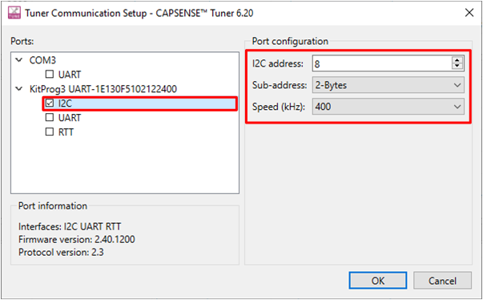

   <br>

4. Click **Connect** or select **Communication** > **Connect** to establish a connection.

   **Figure 4. Establish connection**

   

   <br>

5. Click **Start** or select **Communication** > **Start** to start data streaming from the device.

   **Figure 5. Start tuner communication**

   

   <br>

   The **Widget/Sensor Parameters** tab is updated with the parameters configured in the CAPSENSE&trade; Configurator window. The tuner displays the data from the sensor in the **Widget View** and **Graph View** tabs.

6. Set the **Read mode** to **Synchronized** mode. Navigate to the **Widget View** tab and observe that the **Proximity0** widget is highlighted in blue color when you touch it.

   **Figure 6. Widget view of the CAPSENSE&trade; Tuner**

   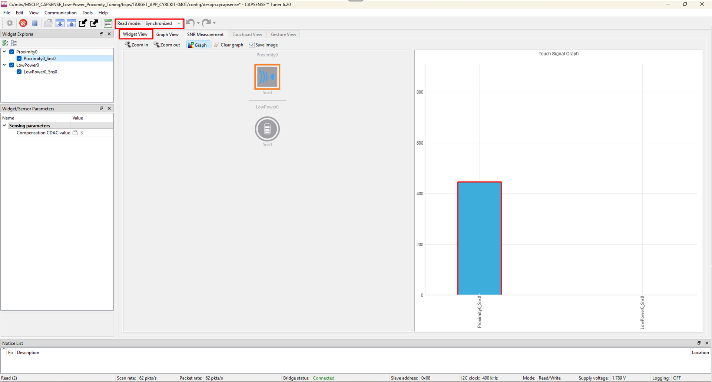

   <br>

7. Go to the **Graph View** tab to view the raw count, baseline, difference count, and status for each sensor. Observe that the low-power widget sensor's (**LowPower0_Sns0**) raw count is plotted after the device completes a full-frame scan (or detects a touch) in **WOT** mode and moves to **Active/ALR** mode.

   **Figure 7. Graph view of the CAPSENSE&trade; Tuner**

   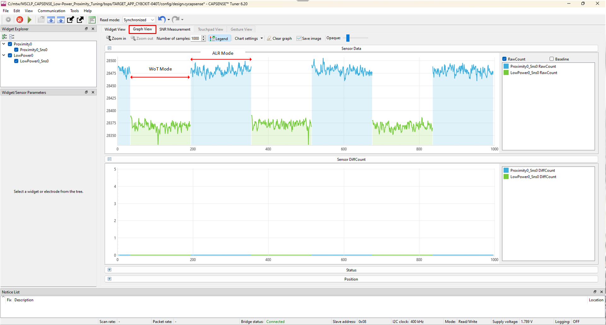

8. See the **Widget/Sensor parameters** section in the CAPSENSE&trade; Tuner window as shown in **Figure 7**.

9. Switch to the **SNR Measurement** tab for measuring the SNR and verify that the SNR is above 5:1 and the signal count is above 50; select the **Proximity0** and **Proximity0_Sns0** sensors, and then click **Acquire Noise** as shown in the following figure.

    **Figure 8. CAPSENSE&trade; Tuner - SNR measurement: Acquire noise**

    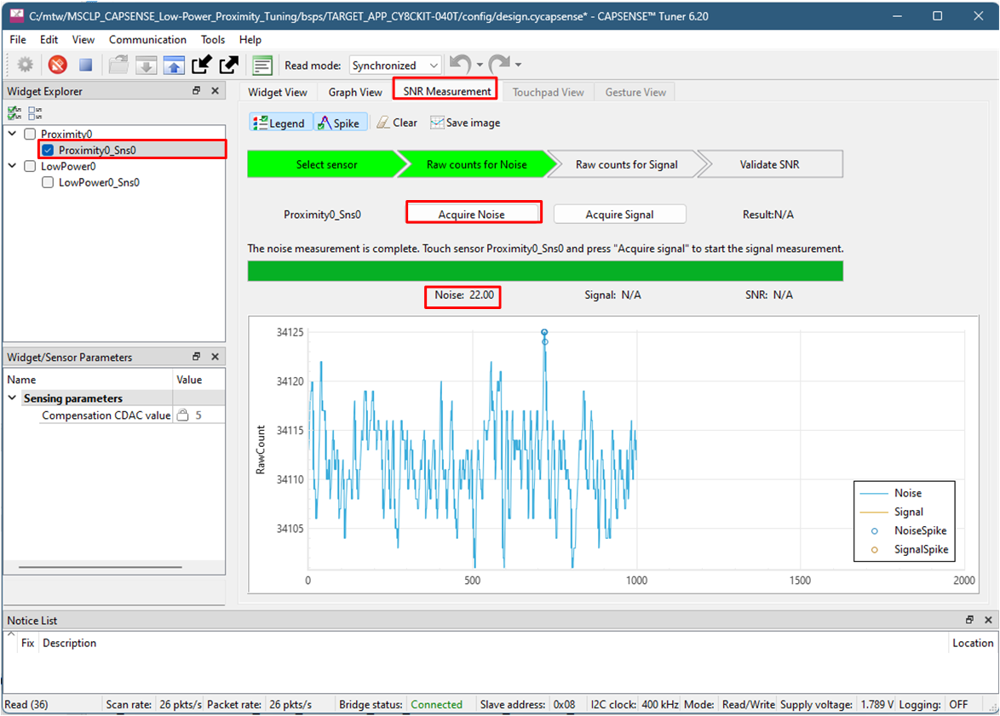

    <br>

      > **Note:** Because the scan refresh rate is lower in **ALR** mode, it takes more time to acquire noise. Touch the CAPSENSE&trade; proximity loop once before clicking **Acquire Noise** to transition the device to **ACTIVE** mode to complete the measurement faster.

10. After noise is acquired, bring your hand over the proximity loop at a distance of around **40 mm** above it and then click **Acquire Signal**. Ensure that the hand remains stable above the proximity loop as long as the signal acquisition is in progress. Observe that the SNR is above 5:1 and the signal count is above 50. If not, repeat signal acquisition by lowering the hand, and therefore, getting a higher signal.

    The calculated SNR on this proximity widget is displayed, as shown in the following figure.

    **Figure 9. CAPSENSE&trade; Tuner - SNR measurement: Acquire signal**

    

    <br>

    The maximum distance the proximity sensor can sense is at the distance where the SNR is greater than 5:1. [Tuning procedure](#tuning-procedure) section explains how changing the configuration affects the distance and SNR.

11. To measure the SNR of the low-power sensor (**LowPower0_Sns0**), set the **Finger threshold** to maximum (65535) in **Widget/Sensor Parameters** for the **LowPower0** widget as shown in **Figure 10**. And set the **Proximity threshold** and **Proximity touch threshold** to their maximum (65535) values in the Widget/Sensor Parameters of the **Proximity0** widget, as shown in **Figure 11**.

    This is required to keep the application in Low Power mode. Otherwise, the application will stop scanning the low-power sensor when there is a proximity or touch detected and will transition to active mode. 

      **Figure 10. CAPSENSE&trade; update finger threshold**

      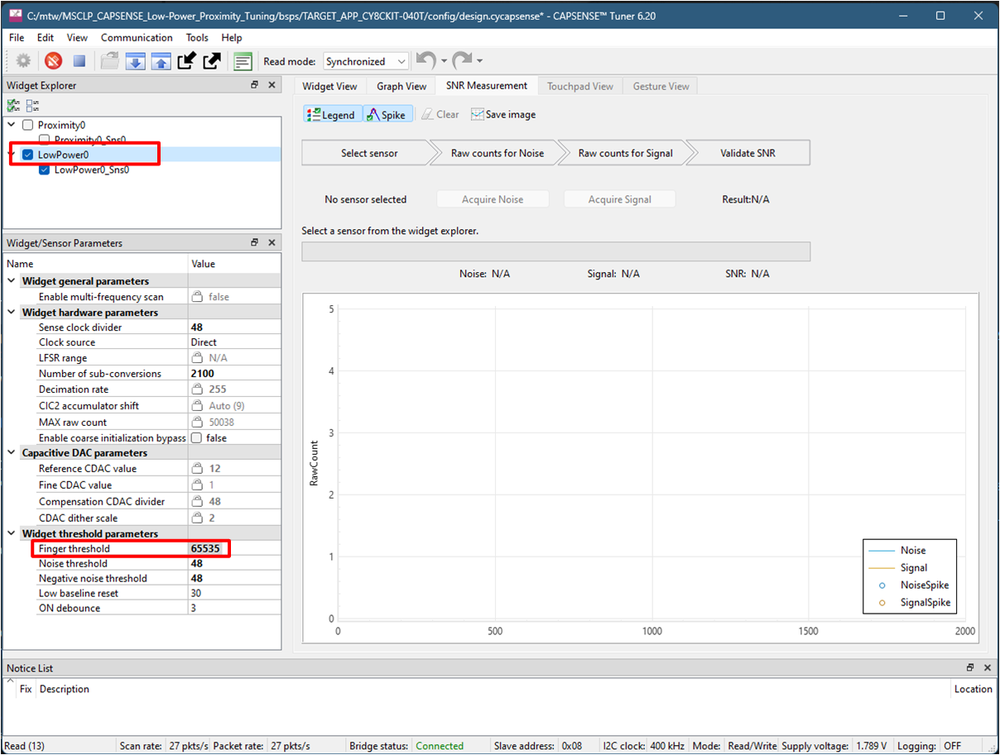
      <br>

      **Figure 11. CAPSENSE&trade; update proximity and touch threshold**

      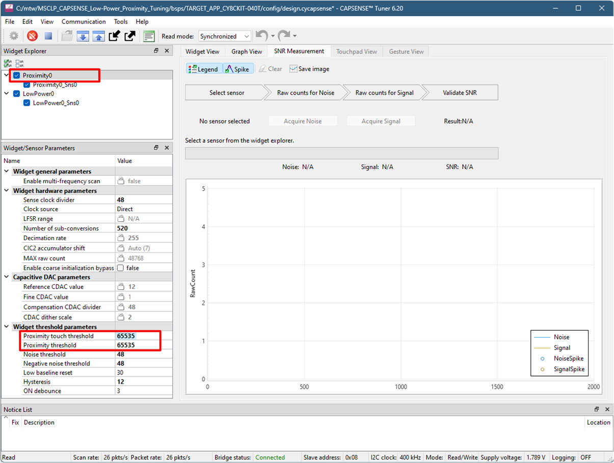

      <br>

12. Repeat steps 9 and 10 to observe the SNR and signal as shown in **Figure 8** and **Figure 9**.

       **Figure 12. CAPSENSE&trade; Tuner - SNR measurement: low-power widget**

       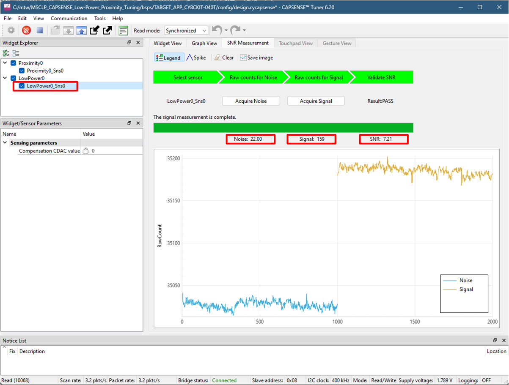

       <br>

### Current consumption

Follow the instructions in the **Measure current at different power modes** section of the code example [PSoC&trade; 4: MSCLP CAPSENSE&trade; low power](https://github.com/Infineon/mtb-example-psoc4-msclp-capsense-low-power) to measure the current consumption.

## Operation at other voltages

[CY8CKIT-040T kit](https://www.infineon.com/CY8CKIT-040T) supports operating voltages of 1.8 V, 3.3 V, and 5 V. Use voltage selection switch available on top of the kit to set the preferred operating voltage and see the [Set up the VDDA supply voltage and debug mode in Device Configurator](#set-up-the-vdda-supply-voltage-and-debug-mode-in-device-configurator) section.

This application functionalities are optimally tuned for 1.8 V. However, you can observe the basic functionalities working across other voltages. 

It is recommended to tune the application with the preferred voltages for optimum performance.

## Tuning procedure

<details><summary><b> Create custom BSP for your board </b></summary>

1. Create a custom BSP for your board with any device by following the steps given in [ModusToolbox&trade; BSP Assistant user guide](https://www.infineon.com/ModusToolboxBSPAssistant). This code example is created for the CY8C4046LQI-T452 device.

2. Open the *design.modus* file from the *{Application root directory}/bsps/TARGET_APP_\<BSP-NAME>/config/* folder obtained in the previous step and enable CAPSENSE&trade; to get the *design.cycapsense* file. CAPSENSE&trade; configuration can be started from scratch as follows:


</details>

The following steps explain the tuning procedure for the proximity loop and the low-power widget.

> **Note:** See the "Manual Tuning" section in the [AN92239 - Proximity sensing with CAPSENSE&trade;](https://www.infineon.com/AN92239) to learn about the considerations for selecting each parameter values. In addition, see the "Low-power widget parameters" section in the [AN234231 - Achieving lowest-power capacitive sensing with PSoC&trade; 4000T](https://www.infineon.com/AN234231) to learn about the considerations for parameter values specific to low-power widgets.

The tuning flow of the proximity widget is shown in the following figure.

   **Figure 13. Proximity widget tuning flow**

   

   <br>

To tune the low-power widget, see the **Tuning flow** section of the code example [PSoC&trade; 4: MSCLP CAPSENSE&trade; low power](https://github.com/Infineon/mtb-example-psoc4-msclp-capsense-low-power).

Do the following to tune the proximity widget:

- [Stage 1: Set initial hardware parameters](#stage-1-set-initial-hardware-parameters)

- [Stage 2: Set sense clock frequency](#stage-2-set-sense-clock-frequency)

- [Stage 3: Fine-tune for required SNR, power, and refresh rate](#stage-3-fine-tune-for-required-snr-power-and-refresh-rate)

- [Stage 4: Tune threshold parameters](#stage-4-tune-threshold-parameters)

### Stage 1: Set initial hardware parameters
-------------------------

1. Connect the board to your PC using the provided USB cable through the KitProg3 USB connector.

2. Launch the Device Configurator tool.

   You can launch the Device Configurator in Eclipse IDE for ModusToolbox&trade; from the **Tools** section in the IDE **Quick Panel** or in standalone mode from *{ModusToolbox&trade; install directory}/ModusToolbox/tools_{version}/device-configurator/device-configurator*. In this case, after opening the application, select **File** > **Open** and open the *design.modus* file of the respective application located in the *{Application root directory}/bsps/TARGET_APP_\<BSP-NAME>/COMPONENT_BSP_DESIGN_MODUS* folder.

3. Enable CAPSENSE&trade; channel in Device Configurator as shown in the following figure.

   **Figure 14. Enable CAPSENSE&trade; in Device Configurator**

   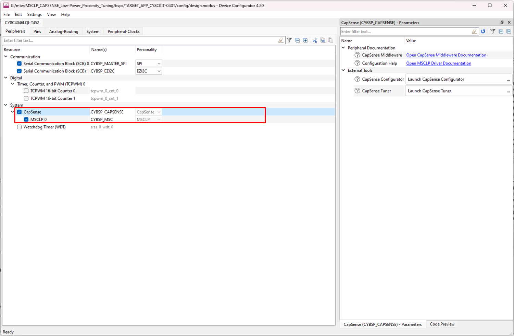

   <br>

   Save the changes and close the window.

4. Launch the CAPSENSE&trade; Configurator tool.

   You can launch the CAPSENSE&trade; Configurator tool in Eclipse IDE for ModusToolbox&trade; from the CAPSENSE&trade; peripheral setting in the Device Configurator or directly from the Tools section in the IDE Quick Panel.

   You can also launch it in standalone mode from *{ModusToolbox&trade; install directory}/ModusToolbox&trade;/tools_{version}/capsense-configurator/capsense-configurator*. In this case, after opening the application, select **File** > **Open** and open the *design.cycapsense* file of the respective application, which is present in the *{Application root directory}/bsps/TARGET_APP_\<BSP-NAME>/COMPONENT_BSP_DESIGN_MODUS* folder.

   See the [ModusToolbox&trade; CAPSENSE&trade; Configurator tool guide](https://www.infineon.com/ModusToolboxCapSenseConfig) for step-by-step instructions on how to configure and launch CAPSENSE&trade; in ModusToolbox&trade;.

5. In the **Basic** tab, add a proximity widget **Proximity0** and a low-power widget **LowPower0**. Set their sensing mode as CSD RM (self-cap) and set the **CSD tuning mode** as **Manual tuning**.

   **Figure 15. CAPSENSE&trade; Configurator - Basic tab**

   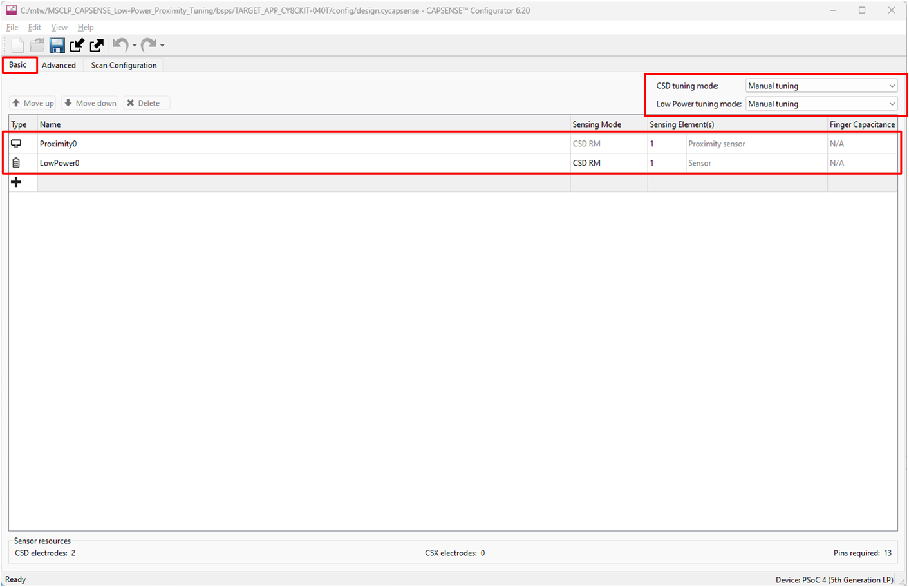

   <br>

6. Do the following in the **General** tab under the **Advanced** tab:

   1. Select **CAPSENSE&trade; IMO Clock frequency** as **46** MHz.

   2. Set the **Modulator clock divider** to **1** to obtain the optimum modulator clock frequency. 

   3. Set the **Number of init sub-conversions** based on the hint shown when you hover over the edit box. Retain the default value (which will be set in [Stage 2: Set sense clock frequency](#stage-2-set-sense-clock-frequency)).

   4. Use **Wake-On-Touch settings** to set the refresh rate and frame timeout while in the lowest power mode (Wake-on-Touch mode).

   5. Set **Wake-on-Touch scan interval (ms)** based on the required low-power state scan refresh rate. For example, to get a 16-Hz refresh rate, set the value to **63**.

   6. Set the **Number of frames in Wake-on-Touch** as the maximum number of frames to be scanned in WoT mode if there is no touch detected. This determines the maximum time the device will be kept in the lowest-power mode if there is no user activity. The maximum time can be calculated by multiplying this parameter with the **Wake-on-Touch scan interval (ms)** value.

      For example, to get 10 seconds as the maximum time in WoT mode, set **Number of frames in Wake-on-Touch** to **160** for the scan interval set as 63 ms.

      > **Note:** For tuning low-power widgets, **Number of frames in Wake-on-Touch** must be less than the  **Maximum number of raw counts values in SRAM** based on the number of sensors in WoT mode as follows:

      **Table 2. Maximum number of raw counts values in SRAM**

       Number of low power widgets  | Maximum number of raw counts in SRAM
       :---------------------| :-----
       1  | 245 
       2  | 117 
       3  | 74 
       4  | 53 
       5  | 40 
       6  | 31 
       7  | 25 
       8  | 21 

      <br>

   7. Retain the default settings for all regular and low-power widget filters. You can enable or update the filters later depending on the signal-to-noise ratio (SNR) requirements in [Stage 3: Fine-tune for required SNR, power, and refresh rate](#stage-3-fine-tune-for-required-snr-power-and-refresh-rate).

      Filters are used to reduce the peak-to-peak noise; however, using filters will result in a higher scan time.

      **Figure 16. CAPSENSE&trade; Configurator - General settings**

      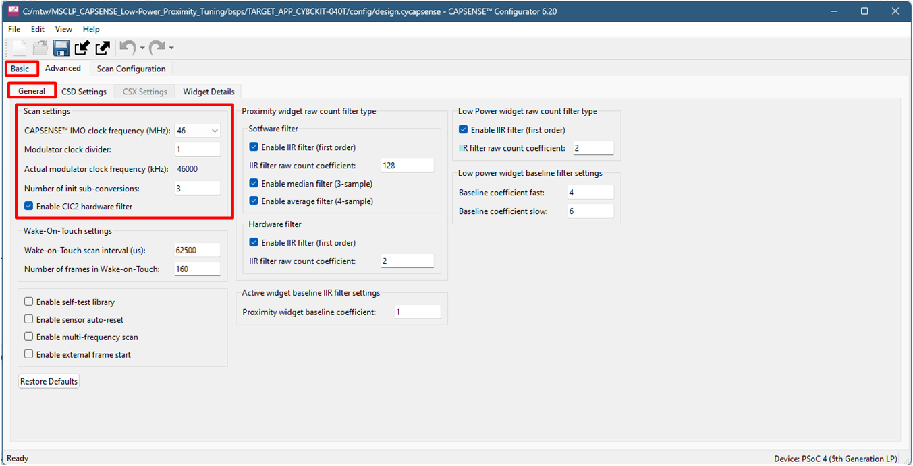

      > **Note:** Each tab has a **Restore Defaults** button to restore the parameters of that tab to their default values.

7. Go to the **CSD Settings** tab and make the following changes:

   1. Set **Inactive sensor connection** as **Shield**.

      Connect the inactive sensor, hatch pattern, or any trace that is surrounding the proximity sensor to the driven shield instead of connecting them to ground. This minimizes the signal due to the liquid droplets falling on the sensor. 

   2. Set **Shield mode** as **Active**.

      Setting the shield to active: The driven shield is a signal that replicates the sensor-switching signal. This minimizes the signal because of the liquid droplets falling on the sensor. 

   3. Set **Total shield count** as **11** (Enabling all the inactive sensors as shield during CSD sensor scan).

   4. Set **Raw count calibration level (%)** to **70**.

      **Figure 17. CAPSENSE&trade; Configurator - Advanced CSD settings**

      

8. Go to the **Widget Details** tab.


   Select **Proximity0** from the left pane and then set the following:

   - **Sense clock divider:** Retain the default value (will be set in [Stage 2:  Set sense clock frequency](#stage-2-set-sense-clock-frequency))

   - **Clock source:** Direct

      > **Note:** Spread spectrum clock (SSC) or PRS clock can be used as a clock source to deal with EMI/EMC issues.

   - **Number of sub-conversions:** 60

     60 is a good starting point to ensure a fast scan time and sufficient signal. This value will be adjusted as required in [Stage 3: Fine-tune for required SNR, power, and refresh rate](#stage-3-fine-tune-for-required-snr-power-and-refresh-rate).

   - **Proximity threshold:** 65535

      Proximity threshold is set to the maximum to avoid waking the device up from WoT mode because of touch detection; this is required to find the signal and SNR. This will be adjusted in [Stage 4: Tune threshold parameters](#stage-4-tune-threshold-parameters).
      
   - **Touch threshold:** 65535

      Touch threshold is also set to the maximum to avoid the waking up of the device from WoT mode.

   - **Noise threshold:** 40

   - **Negative noise threshold:** 40

   - **Low baseline reset:** 255

   - **Hysteresis:** 40

   - **ON debounce:** 3

      **Figure 18. CAPSENSE&trade; Configurator - Proximity Widget Details tab under the Advanced tab**

      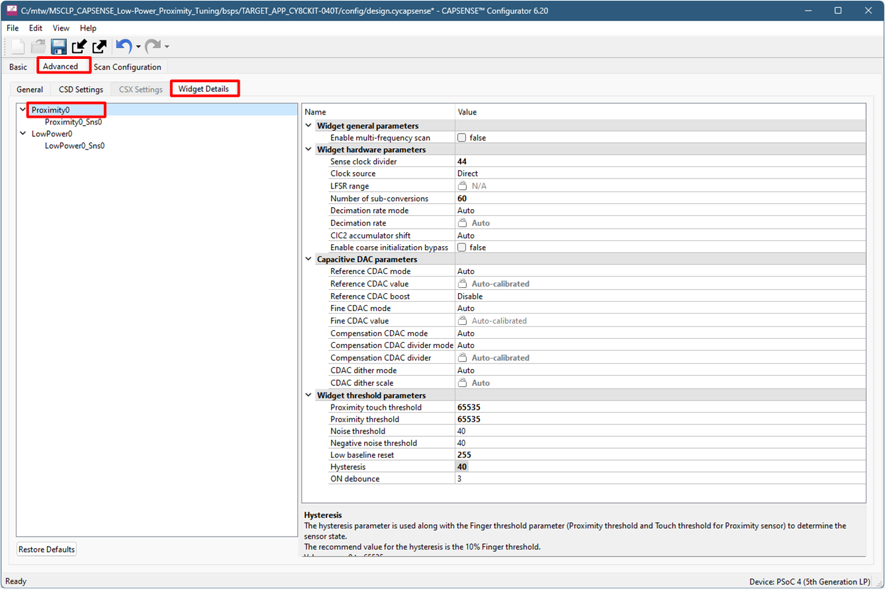

     Now, select **LowPower0** from the left pane, and then set the following:

   - **Sense clock divider:** Retain the default value (will be set in [Stage 2: Set sense clock frequency](#stage-2-set-sense-clock-frequency))

   - **Clock source:** Direct

      > **Note:** Spread spectrum clock (SSC) or PRS clock can be used as the clock source to deal with EMI/EMC issues.

   - **Number of sub-conversions: 60**

     60 is a good starting point to ensure a fast scan time and sufficient signal. This value will be adjusted as required in [Stage 3: Fine-tune for required SNR, power, and refresh rate](#stage-3-fine-tune-for-required-snr-power-and-refresh-rate).

   - **Finger threshold:** 65535

      Finger threshold is set to the maximum to avoid the device waking up from WoT mode due to touch detection so that you can acquire signal for SNR measurement.

   - **Noise threshold:** 10

   - **Negative noise threshold:** 10

   - **Low baseline reset:** 255

   - **ON debounce:** 1

      **Figure 19. CAPSENSE&trade; Configurator - Low-Power Widget details tab under the Advanced tab**

     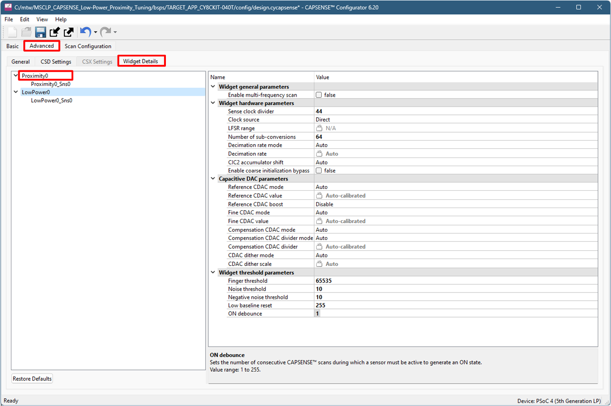

     <br>

   > **Note:** These values reduce the influence of the baseline on the sensor signal, which helps to get the true difference count. Retain the default values for all other threshold parameters; these parameters are set in [Stage 4: Tune threshold parameters](#stage-4-tune-threshold-parameters).

9. Go to the **Scan Configuration** tab to select the pins and scan slots. Do the following:

   1. Configure the pins for electrodes using the drop-down menu.

   2. Configure the scan slots using the **Auto-assign slots** option. The other option is to allot each sensor a scan slot based on the entered slot number.

   3. Select Proximity0_Sns0 as **Ganged** under the **LowPower0** widget as shown in **Figure 20**.

   4. Check the notice list for warnings or errors.

      **Figure 20. Scan Configuration tab**

      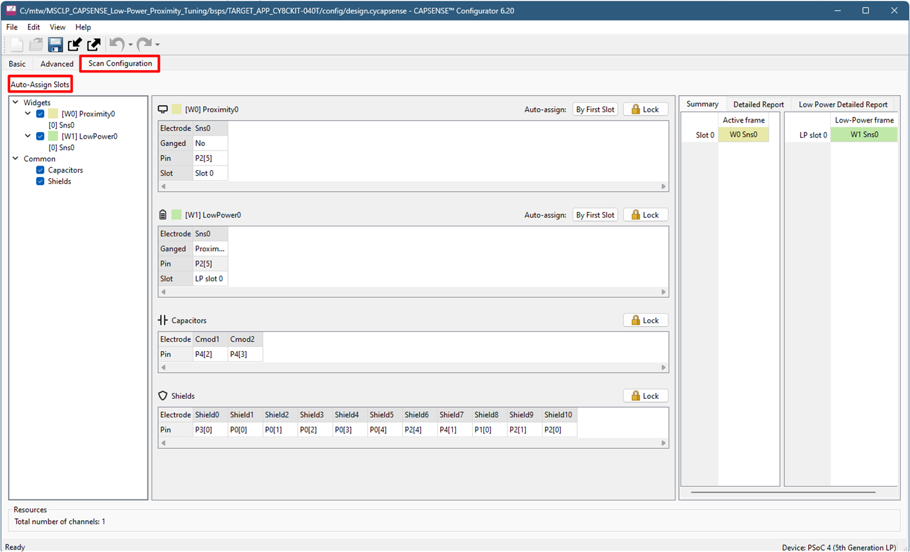

      <br>

10. Click **Save** to apply the settings.

See the [CAPSENSE&trade; design guide](https://www.infineon.com/AN85951) for detailed information on tuning parameters mentioned here.


### Stage 2: Set sense clock frequency
-------------------------
The sense clock is derived from the modulator clock using a clock-divider and is used to scan the sensor by driving the CAPSENSE&trade; switched capacitor circuits. Both the clock source and clock divider are configurable.

Select the maximum sense clock frequency such that the sensor and shield capacitance are charged and discharged completely in each cycle. This can be verified using an oscilloscope and an active probe. To view the charging and discharging waveforms of the sensor, probe at the sensor (or as close as possible to the sensors), and not at the pins or resistor. 

**Figure 21** shows proper charging when  the sense clock frequency is correctly tuned, i.e., the voltage is settling to the required voltage at the end of each phase. **Figure 22** shows incomplete settling (charging/discharging) and therefore, the sense clock divider is set to **28** as shown in the following figure.


   **Figure 21. Proper charge cycle of a sensor**

   

   <br>

   **Figure 22. Improper charge cycle of a sensor**

   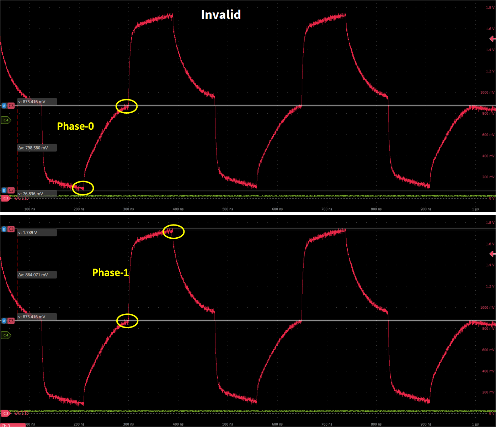

   <br>
   
   To set the proper sense clock frequency, follow these steps:

   1. Program the board and launch CAPSENSE&trade; Tuner.

   2. Observe the charging waveform of the sensor and shield as described earlier. 

   3. If the charging is incomplete, increase the sense clock divider. Do this in CAPSENSE&trade; Tuner by selecting the sensor and editing the sense clock divider parameter in the **Widget/Sensor Parameters** panel.

      > **Note:** The sense clock divider should be **divisible by 4**. This ensures that all four scan phases have equal durations. After editing the value, click the **Apply to Device** button and observe the waveform again. Repeat this until complete settling is observed. Using a passive probe will add an additional parasitic capacitance of around 15 pF; therefore, should be considered during the tuning.

      
   4. Click the **Apply to Project** button so that the configuration is saved to your project. 

      **Figure 23. Sense clock divider setting**

      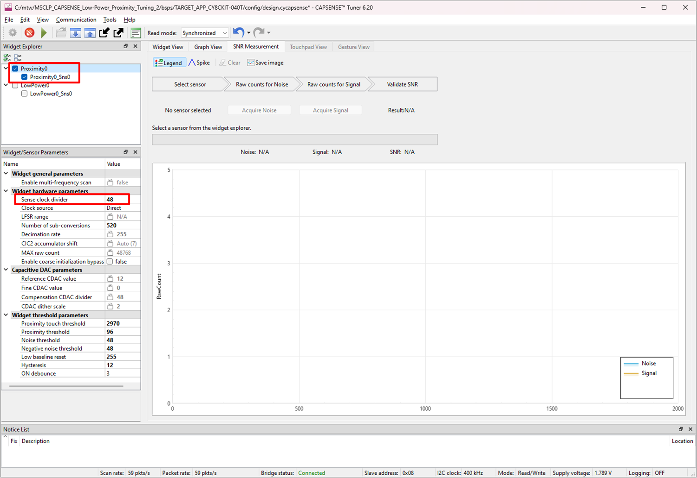

      <br>
      

   5. Repeat this process for all the sensors and the shield. Each sensor may require a different sense clock divider value to charge/discharge completely. But all the sensors which are in the same scan slot need to have the same sense clock source, sense clock divider, and number of sub-conversions. Therefore, take the largest sense clock divider in a given scan slot and apply it to all the other sensors that share that slot.

      **Table 3. Sense clock parameters obtained based on sensors for CY8CKIT-040T kit**

      Parameter | Value
      :-------- |:-----------
      Modulator clock divider | 1
      Sense clock divider | 48

      <br>

### Stage 3: Fine-tune for required SNR, power, and refresh rate
-------------------------
The sensor should be tuned to have a minimum SNR of 5:1 and a minimum signal of 50 to ensure reliable operation. The sensitivity can be increased by increasing number of sub-conversions and noise can be decreased by enabling available filters. 

The steps for optimizing these parameters are as follows:

1. Measure the SNR as mentioned in the [Operation](#operation) section.

   Measure the SNR by placing your hand above the proximity loop at maximum proximity height (40 mm in this case).

2. If the SNR is less than 5:1 increase the number of sub-conversions. Edit the number of sub-conversions (N<sub>sub</sub>) directly in the **Widget/Sensor parameters** tab of the CAPSENSE&trade; Tuner.

      > **Note:** Number of sub-conversion should be greater than or equal to 8.

3. PSoC&trade; 4000T CAPSENSE&trade; has a built-in CIC2 filter which increases the resolution for the same scan time. This example has the CIC2 filter enabled.

   Calculate the decimation rate of the CIC2 filter using **Equation 1**. Note that for our case this value comes automatically. The resolution increases with an increase in the decimation rate; therefore, set the maximum decimation rate indicated by the equation.

      **Equation 1. Decimation rate**
      <br><br>
      **$$DecimationRate = min\left(\frac {SnsClkDiv * N_{sub}}{3},255\right) $$**

      Where,
      
      - $N_{sub}$ is Number of Sub-Conversions
      - $SnsClkDiv$ is Sense Clock Divider value

4.  Load the parameters to the device and measure SNR as mentioned in steps 10 and 11 in the **Monitor data using CAPSENSE&trade; Tuner** section. 
   
      Repeat steps 1 to 4 until the following conditions are met:

      - Measured SNR from the previous stage is greater than 5:1

      - Signal count is greater than 50

5. If the system is noisy (>40% of signal), enable filters.

   Whenever the CIC2 filter is enabled, it is recommended to enable the IIR filter for optimal noise reduction. Therefore, this example has the IIR filter enabled as well.

   To enable and configure filters available in the system:

   a. Open **CAPSENSE&trade; Configurator** from ModusToolbox&trade; **Quick Panel** and select the appropriate filter.

      **Figure 24. Filter settings in CAPSENSE&trade; Configurator**

      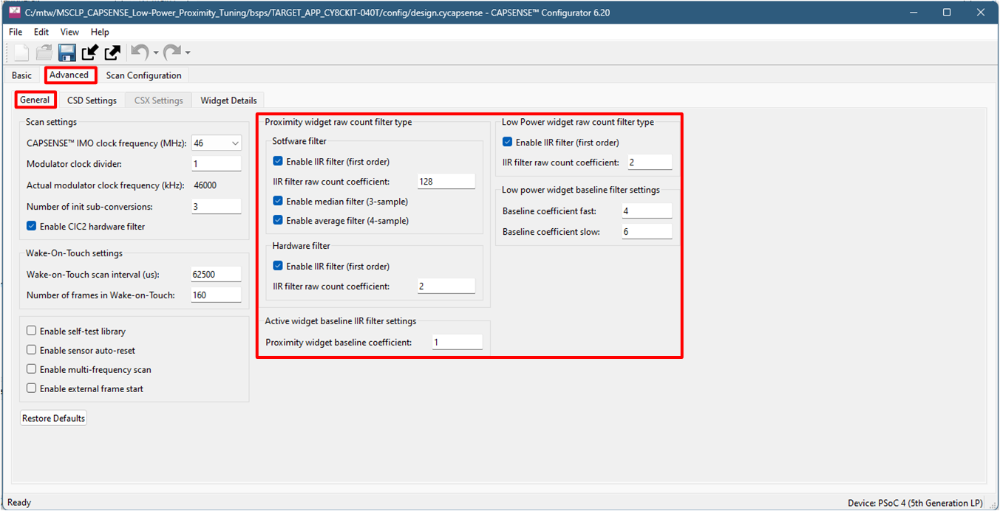

      <br>

      > **Note** : Add the filter based on the type of noise in your measurements. See [ModusToolbox&trade; CAPSENSE&trade; Configurator user guide](https://www.infineon.com/ModusToolboxCapSenseConfig) for details.

   b. Click **Save** and close CAPSENSE&trade; Configurator. Program the device to update the filter settings.

   > **Note** : Increasing number of sub-conversions and enabling filters increases the scan time which in turn decreases the responsiveness of the sensor. Increase in scan time also increases the power consumption. Therefore, the number of sub-conversions and filter configuration must be optimized to achieve a balance between SNR, power, and refresh rate. 

### Stage 4: Tune threshold parameters
-------------------------
Various thresholds, relative to the signal, need to be set for each sensor. Do the following in CAPSENSE&trade; Tuner to set up the thresholds for a widget:

1. Switch to the **Graph View** tab and select **Proximity0**.

2. Place your hand at 40 mm directly above the proximity sensor and monitor the touch signal in the **Sensor signal** graph, as shown in the following figure. 

   **Figure 25. Sensor signal when hand is in the proximity of the sensor**

   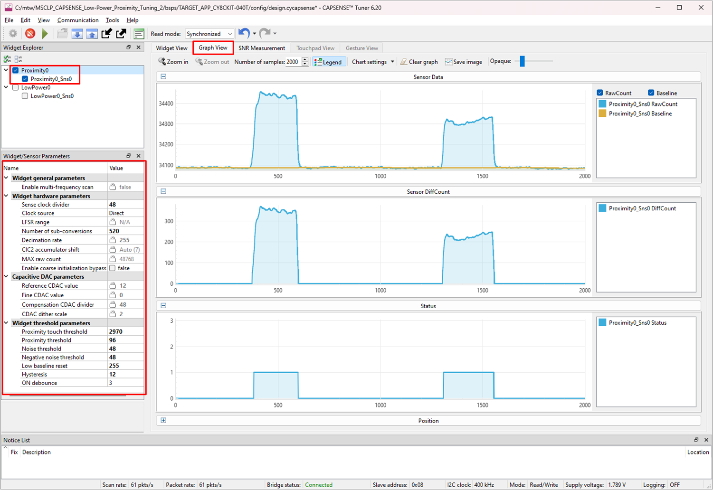

   <br>

3. Note the signal measured and set the thresholds according to the following recommendations:

   - **Proximity threshold** = 80% of the signal

   - **Proximity touch threshold** = 80% of the signal

     Here, the touch threshold denotes the threshold for the proximity sensor to detect a touch when it is touched by a finger. When the proximity sensor is touched, the sensor yields a higher signal compared the proximity signal; therefore, it is the **touch signal**. To measure the touch signal count, touch the sensor and monitor the signal in the **Sensor signal** graph.

   - **Noise threshold** = 40% of the signal

   - **Negative noise threshold** = 40% of the signal

   - **Hysteresis** = 10% of signal

   - **Low baseline reset** = 255

      **Low baseline reset** is set to 255 so that the baseline does not reset at all due to abnormal dip in raw count for long time.

   - **Hysteresis** = 10% of the signal

   - **ON debounce** = 3

4. For the **LowPower0** sensor, first configure the **Finger threshold** to 65535 and wait for the application to enter Low Power mode. Because the **Finger threshold** is set to maximum, touching the low power button will not switch the application to active mode. Repeat steps 2 to 4 for the low power button.

5. Apply the settings to the device by clicking **To device**.

   **Figure 26. Apply settings to device**

   

   <br>

   If your sensor is tuned correctly, you will observe that the proximity status goes from `0` to `1` in the **Status** sub-window of the **Graph View** window as shown in the following figure. The successful tuning of the proximity sensor is also indicated by LED1 in the kit; it turn ON (green) when the hand comes closer than the maximum distance and turn OFF when the hand is moved away from the proximity sensor.

   **Figure 27. Sensor status in CAPSENSE&trade; Tuner showing proximity status**

   

   <br>

   After touching the proximity loop, a further change in status from `1` to `3` can be observed which indicates a touch. Along with this, LED1 will turn ON in blue color.

   **Figure 28. Sensor status in CAPSENSE&trade; Tuner showing touch status**

   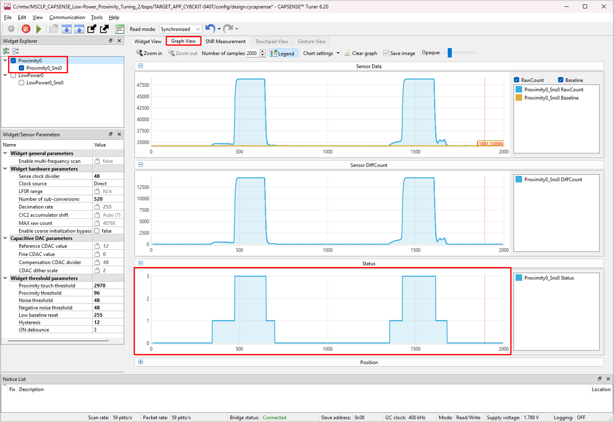

   <br>

6. Click **Apply to Project** as shown in the following figure. The change is updated in the *design.cycapsense* file. 
   
   Close **CAPSENSE&trade; Tuner** and launch **CAPSENSE&trade; Configurator**. You should now see all the changes that you made in the CAPSENSE&trade; Tuner reflected in the **CAPSENSE&trade; Configurator**.

   **Figure 29. Apply settings to Project**

   

   <br>

   **Table 4. Tuning parameters obtained based on sensors for CY8CKIT-040T kit**

   Parameter | Proximity0 | LowPower0
   :-------- |:-----------|:---------
   Proximity signal | 120 |120 
   Touch signal | 3712 | - 
   Proximity threshold | 96 |96
   Touch threshold | 2970 |- 
   Noise threshold |48|48
   Negative noise threshold |48 |48 
   Low baseline reset | 255 |255 
   Hysteresis | 12 |12 
   ON debounce | 3|3

   <br>

   > **Note:** The touch threshold is the any single finger touch threshold.

   </details>

<br>

###  **Process time measurement**
--------------------


To set the optimum refresh rate for each power mode, measure the processing time of the application.

Follow these steps to measure the process time of the blocks of application code while excluding the scan time:

1. Enable ENABLE_RUN_TIME_MEASUREMENT macro in *main.c* as follows:
      
      ```
      #define ENABLE_RUN_TIME_MEASUREMENT (1u)
      ```     
      This macro enables the system tick configuration and runtime measurement functionalities. 

2.	Place the start_runtime_measurement() function call before your application code and the stop_runtime_measurement() function call after it. The stop_runtime_measurement() function will return the execution time in microseconds (µs). 
 
      ```   
         #if ENABLE_RUN_TIME_MEASUREMENT
            uint32_t run_time = 0;
            start_runtime_measurement();
         #endif

         /* User Application Code Start */
         .
         .
         .
         /* User Application Code Stop */

         #if ENABLE_RUN_TIME_MEASUREMENT
            run_time = stop_runtime_measurement();
         #endif
      ```

3.	Run the application in debug mode with breakpoints placed at the active_processing_time and alr_processing_time variables as follows:
      ```
         #if ENABLE_RUN_TIME_MEASUREMENT
            active_processing_time = stop_runtime_measurement();
         #endif
         and 
         #if ENABLE_RUN_TIME_MEASUREMENT
            alr_processing_time = stop_runtime_measurement();
         #endif
      ``` 
4. Read the variables by adding them into **Expressions view** tab.
5. Update related macros with the earlier measured processing times in main.c as follows:
      ```
      #define ACTIVE_MODE_PROCESS_TIME     (xx)

      #define ALR_MODE_PROCESS_TIME        (xx)
      ```


### **Scan time measurement**
--------------------
Scan time is also required for calculating the refresh rate of the application power modes. The total scan time of all the widgets in this code example is 10 µs.

It can be calculated as follows:

The scan time includes the MSCLP initialization time, Cmod, and the total sub-conversions of the sensor. 

To control the Cmod initialization sequence, set the "Enable Coarse initialization bypass" configurator option as listed in the following table:

Enable coarse initialization bypass | Behavior
:-------------|:---------
TRUE|Cmod initialization happens only once before scanning the sensors of the widget
FALSE| Cmod initialization happens before scanning each sensor of the widget

Use the following equations to measure the widgets scan time based on coarse initialization bypass options selected: 

**Equation 2. Scan time calculation of a widget with coarse initialization bypass enabled**
<br><br>
$$ScanTime_{widget} = \left(\sum_{sensor=1}^n \left((N_{init} + N_{sub}) * \frac {SnsClkDiv}{F_{mod}}\right)\right) +k $$
<br><br>

**Equation 3. Scan time calculation of a widget with coarse initialization bypass disabled**
<br><br>
$$ScanTime_{widget} = \sum_{sensor=1}^n \left((N_{init} + N_{sub}) * \frac {SnsClkDiv}{F_{mod}} +k \right) $$
<br>


Where,

- $n$ - Total number of sensors in the widget

- $N_{sub}$ - Number of sub-conversions

- $N_{init}$ - Number of init sub-conversions

- $SnsClkDiv$ - Sense clock divider

- $F_{mod}$ - Modulator clock frequency

- $k$ - Measured Initialization time (MSCLP+Cmod)

This value of '$k$' measured for this application is ~9 µs. It remains constant for all widgets and can be measured using oscilloscope as shown in the following figure.

   **Figure 30. 'k' value measurement**

   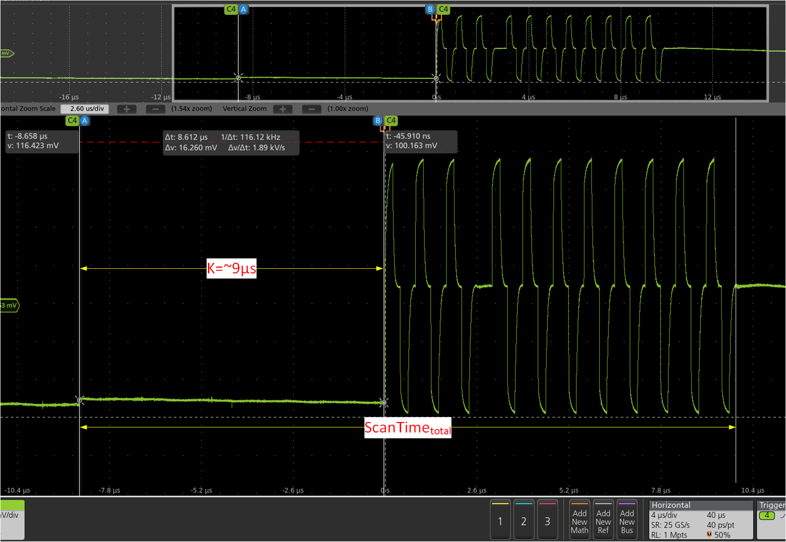

   <br>

Update the following macros in *main.c* using the scan time calculated. The value remains the same for both the macros for this application.

```
#define ACTIVE_MODE_FRAME_SCAN_TIME     (xx)

#define ALR_MODE_FRAME_SCAN_TIME        (xx)
```

> **Note :** If the application has more than one widget, add the scan times of individual widgets calculated.

<br>

## Debugging


You can debug the example to step through the code.


<details><summary><b>In Eclipse IDE</b></summary>

Use the **\<Application Name> Debug (KitProg3_MiniProg4)** configuration in the **Quick Panel**. For details, see the "Program and debug" section in the [Eclipse IDE for ModusToolbox&trade; user guide](https://www.infineon.com/MTBEclipseIDEUserGuide).


</details>


<details><summary><b>In other IDEs</b></summary>

Follow the instructions in your preferred IDE.

</details>


By default, the debug option is disabled in the Device Configurator. To enable the debug option, see the [Set up VDDA and debug mode in Device Configurator](#set-up-the-vdda-supply-voltage-and-debug-mode-in-device-configurator) section. To achieve low power consumption, it is recommended to disable it. 


## Design and implementation

The project contains the following widgets:

1. Proximity widget with 1 electrode configured in CSD-RM Sensing mode.

2. Low power widget with 1 electrode configured in CSD-RM Sensing mode. 

See the [Tuning procedure](#tuning-procedure) section for step-by-step instructions on configuring these widgets.

The project uses the [CAPSENSE&trade; middleware](https://infineon.github.io/capsense/capsense_api_reference_manual/html/index.html); see the [ModusToolbox&trade; user guide](https://www.infineon.com/ModusToolboxUserGuide) for more details on selecting a middleware.

See [AN85951 – PSoC&trade; 4 and PSoC&trade; 6 MCU CAPSENSE&trade; design guide](https://www.infineon.com/an85951) for more details of CAPSENSE&trade; features and usage.

The design also has an EZI2C peripheral and a SPI master peripheral. The EZI2C slave peripheral is used to monitor the information of sensor raw and processed data on a PC using the CAPSENSE&trade; Tuner available in the Eclipse IDE for ModusToolbox&trade; via I2C communication.

The MOSI pin of the SPI slave peripheral is used to transfer data to the three serially connected LEDs for controlling color, brightness, and ON/OFF operation.

The firmware is designed to support the following application states:

- Active state
- Active low-refresh rate state
- Wake-on-touch state

   **Figure 31. Firmware state-machine**

   

   <br>

The firmware state machine and the operation of the device in four different states are explained in the following steps:

1. Initializes and starts all hardware components after reset.

2. The device starts CAPSENSE&trade; operation in the Active state. In this state, the following steps occur:

   1. The device scans all CAPSENSE&trade; sensors present on the board.

   2. During the ongoing scan operation, the CPU moves to the Deep Sleep state.

   3. The interrupt generated on scan completion wakes the CPU, which processes the sensor data and transfers the data to CAPSENSE&trade; Tuner through EZI2C.

   4. Turn ON the serial LED with specific colors and patterns to indicate the specific proximity or touch detection.

   In Active state, a scan of the selected sensors happen with the highest refresh rate of 128 Hz.

3. Enters the Active low-refresh rate state when there is no touch or object in proximity detected for a timeout period. In this state, selected sensors are scanned with a lower refresh rate of 32 Hz. Because of this, power consumption in the Active low-refresh rate state is lower compared to the Active state. The state machine returns to the Active state if there is touch or object in proximity detected by the sensor.

4. Enters the Wake-on-Touch state when there is no touch or object in proximity detected in Active low-refresh rate state for a timeout period. In this state, the CPU is set to deep sleep, and is not involved in CAPSENSE&trade; operation. This is the lowest power state of the device. In the Wake-on-Touch state, the CAPSENSE&trade; hardware executes the scanning of the selected sensors called "low-power widgets" and processes the scan data for these widgets. If touch is detected, the CAPSENSE&trade; block wakes up the CPU and the device enters to the Active state.

There are three onboard RGB LEDs connected to the SPI MOSI pin of the device. These LEDs form a daisy-chain connection and communicate over the serial interface. The LEDs accept a 32-bit input code, with three bytes for red, green, and blue colors, five bits for global brightness, and three blank '1' bits. See the [LED datasheet](https://media.digikey.com/pdf/Data%20Sheets/Everlight%20PDFs/12-23C_RSGHBHW-5V01_2C_Rev4_12-17-18.pdf) for more details.

### Firmware flow

**Figure 32. Firmware flowchart**


<br>

### Set up the VDDA supply voltage and debug mode in Device Configurator

1. Open Device Configurator from the **Quick Panel**.

2. Go to the **System** tab. Select the **Power** resource, and set the VDDA value under **Operating conditions** as shown in the following figure.

   **Figure 33. Setting the VDDA supply in the System tab of Device Configurator**

   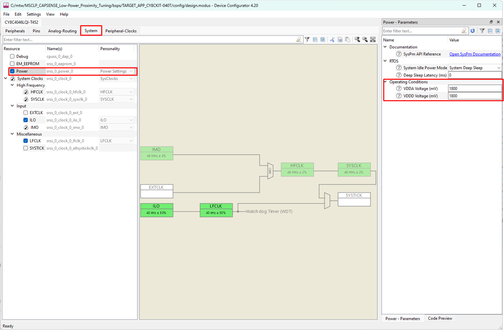

   <br>

3. By default, the debug mode is disabled for this application to reduce power consumption. Enable the debug mode to enable the SWD pins as shown in the following figure.


   **Figure 34. Enable debug mode in the System tab of Device Configurator**

   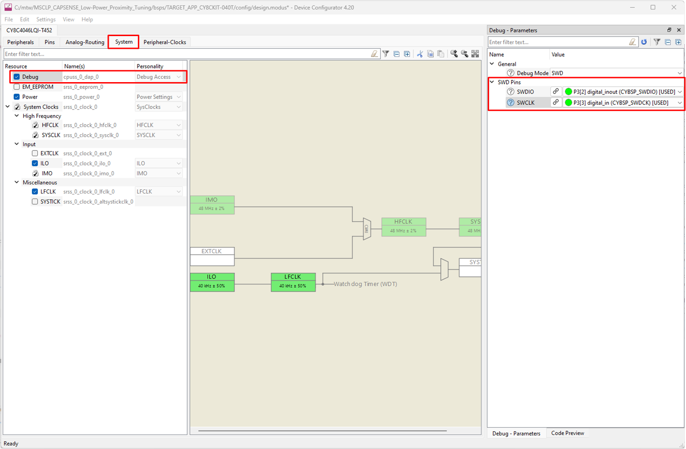

<br>

### Resources and settings


**Figure 35. EZI2C settings**

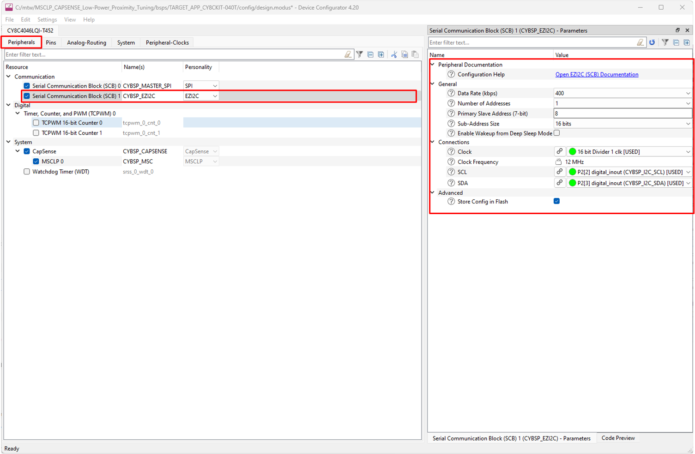

<br>

**Figure 36. SPI settings**

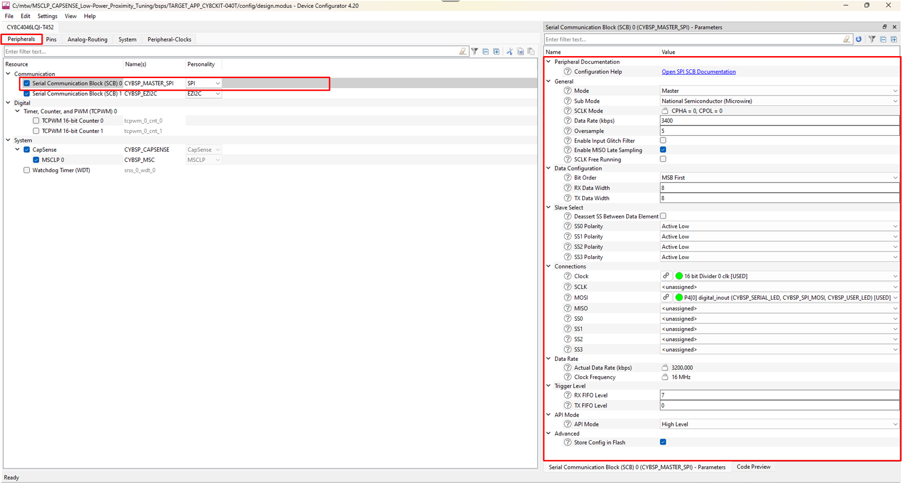

<br>

**Table 5. Application resources**

 Resource  |  Alias/object     |    Purpose 
 :------- | :------------    | :------------ 
 SCB (I2C) (PDL) | CYBSP_EZI2C          | EZI2C slave driver to communicate with CAPSENSE&trade; Tuner
 SCB (SPI) (PDL) | CYBSP_MASTER_SPI          | SPI master driver to control serial LEDs
 CAPSENSE&trade; | CYBSP_MSC | CAPSENSE&trade; driver to interact with the MSC hardware and interface the CAPSENSE&trade; sensors
 Digital pin | CYBSP_SERIAL_LED | To show the proximity operation and power mode states


<br>


## Related resources


Resources  | Links
-----------|----------------------------------
Application notes  | [AN79953](https://www.infineon.com/AN79953) – Getting started with PSoC&trade; 4 <br> [AN85951](https://www.infineon.com/AN85951) – PSoC&trade; 4 and PSoC&trade; 6 MCU CAPSENSE&trade; design guide <br> [AN234231](https://www.infineon.com/AN234231) – Achieving lowest-power capacitive sensing with PSoC&trade; 4000T <br> [AN92239](https://www.infineon.com/AN92239) – Proximity sensing with CAPSENSE&trade;
Code examples  | [Using ModusToolbox&trade;](https://github.com/Infineon/Code-Examples-for-ModusToolbox-Software) on GitHub
Device documentation | [PSoC&trade; 4 datasheets](https://www.infineon.com/cms/en/search.html#!view=downloads&term=psoc4&doc_group=Data%20Sheet) <br>[PSoC&trade; 4 technical reference manuals](https://www.infineon.com/cms/en/search.html#!view=downloads&term=psoc4&doc_group=Additional%20Technical%20Information)
Development kits | Select your kits from the [Evaluation board finder](https://www.infineon.com/cms/en/design-support/finder-selection-tools/product-finder/evaluation-board).
Libraries on GitHub  | [mtb-pdl-cat2](https://github.com/Infineon/mtb-pdl-cat2) – PSoC&trade; 4 Peripheral Driver Library (PDL) <br>  [mtb-hal-cat2](https://github.com/Infineon/mtb-hal-cat2) – Hardware Abstraction Layer (HAL) library
Middleware on GitHub  | [capsense](https://github.com/Infineon/capsense) – CAPSENSE&trade; library and documents <br> [psoc4-middleware](https://github.com/Infineon/modustoolbox-software#libraries) – Links to all PSoC&trade; 4 middleware
Tools  | [ModusToolbox&trade;](https://www.infineon.com/modustoolbox) – ModusToolbox&trade; software is a collection of easy-to-use libraries and tools enabling rapid development with Infineon MCUs for applications ranging from wireless and cloud-connected systems, edge AI/ML, embedded sense and control, to wired USB connectivity using PSoC&trade; Industrial/IoT MCUs, AIROC&trade; Wi-Fi and Bluetooth&reg; connectivity devices, XMC&trade; Industrial MCUs, and EZ-USB&trade;/EZ-PD&trade; wired connectivity controllers. ModusToolbox&trade; incorporates a comprehensive set of BSPs, HAL, libraries, configuration tools, and provides support for industry-standard IDEs to fast-track your embedded application development.

<br>


## Other resources


Infineon provides a wealth of data at [www.infineon.com](https://www.infineon.com) to help you select the right device, and quickly and effectively integrate it into your design.


## Document history

Document title: *CE236033* – *PSoC&trade; 4: MSCLP CAPSENSE&trade; low-power proximity tuning*

 Version | Description of change
 ------- | ---------------------
 1.0.0   | New code example
 1.1.0   | Minor folder structure changes that does not break backward compatibility
 1.2.0   | Minor README and configuration update
 1.3.0   | Updated to ModusToolbox&trade; version 3.1 
 1.4.0   | Minor fixes in README
 1.5.0   | Scan time calculation updates and debug disabled by default
 2.0.0   | Major update to support ModusToolbox&trade; v3.2 and and CAPSENSE&trade; Middleware v5.0. <br> This version is not backward compatible with previous versions of ModusToolbox&trade;
 <br>


All referenced product or service names and trademarks are the property of their respective owners.

The Bluetooth&reg; word mark and logos are registered trademarks owned by Bluetooth SIG, Inc., and any use of such marks by Infineon is under license.


---------------------------------------------------------

© Cypress Semiconductor Corporation, 2022-2024. This document is the property of Cypress Semiconductor Corporation, an Infineon Technologies company, and its affiliates ("Cypress").  This document, including any software or firmware included or referenced in this document ("Software"), is owned by Cypress under the intellectual property laws and treaties of the United States and other countries worldwide.  Cypress reserves all rights under such laws and treaties and does not, except as specifically stated in this paragraph, grant any license under its patents, copyrights, trademarks, or other intellectual property rights.  If the Software is not accompanied by a license agreement and you do not otherwise have a written agreement with Cypress governing the use of the Software, then Cypress hereby grants you a personal, non-exclusive, nontransferable license (without the right to sublicense) (1) under its copyright rights in the Software (a) for Software provided in source code form, to modify and reproduce the Software solely for use with Cypress hardware products, only internally within your organization, and (b) to distribute the Software in binary code form externally to end users (either directly or indirectly through resellers and distributors), solely for use on Cypress hardware product units, and (2) under those claims of Cypress's patents that are infringed by the Software (as provided by Cypress, unmodified) to make, use, distribute, and import the Software solely for use with Cypress hardware products.  Any other use, reproduction, modification, translation, or compilation of the Software is prohibited.
<br>
TO THE EXTENT PERMITTED BY APPLICABLE LAW, CYPRESS MAKES NO WARRANTY OF ANY KIND, EXPRESS OR IMPLIED, WITH REGARD TO THIS DOCUMENT OR ANY SOFTWARE OR ACCOMPANYING HARDWARE, INCLUDING, BUT NOT LIMITED TO, THE IMPLIED WARRANTIES OF MERCHANTABILITY AND FITNESS FOR A PARTICULAR PURPOSE.  No computing device can be absolutely secure.  Therefore, despite security measures implemented in Cypress hardware or software products, Cypress shall have no liability arising out of any security breach, such as unauthorized access to or use of a Cypress product. CYPRESS DOES NOT REPRESENT, WARRANT, OR GUARANTEE THAT CYPRESS PRODUCTS, OR SYSTEMS CREATED USING CYPRESS PRODUCTS, WILL BE FREE FROM CORRUPTION, ATTACK, VIRUSES, INTERFERENCE, HACKING, DATA LOSS OR THEFT, OR OTHER SECURITY INTRUSION (collectively, "Security Breach").  Cypress disclaims any liability relating to any Security Breach, and you shall and hereby do release Cypress from any claim, damage, or other liability arising from any Security Breach.  In addition, the products described in these materials may contain design defects or errors known as errata which may cause the product to deviate from published specifications. To the extent permitted by applicable law, Cypress reserves the right to make changes to this document without further notice. Cypress does not assume any liability arising out of the application or use of any product or circuit described in this document. Any information provided in this document, including any sample design information or programming code, is provided only for reference purposes.  It is the responsibility of the user of this document to properly design, program, and test the functionality and safety of any application made of this information and any resulting product.  "High-Risk Device" means any device or system whose failure could cause personal injury, death, or property damage.  Examples of High-Risk Devices are weapons, nuclear installations, surgical implants, and other medical devices.  "Critical Component" means any component of a High-Risk Device whose failure to perform can be reasonably expected to cause, directly or indirectly, the failure of the High-Risk Device, or to affect its safety or effectiveness.  Cypress is not liable, in whole or in part, and you shall and hereby do release Cypress from any claim, damage, or other liability arising from any use of a Cypress product as a Critical Component in a High-Risk Device. You shall indemnify and hold Cypress, including its affiliates, and its directors, officers, employees, agents, distributors, and assigns harmless from and against all claims, costs, damages, and expenses, arising out of any claim, including claims for product liability, personal injury or death, or property damage arising from any use of a Cypress product as a Critical Component in a High-Risk Device. Cypress products are not intended or authorized for use as a Critical Component in any High-Risk Device except to the limited extent that (i) Cypress's published data sheet for the product explicitly states Cypress has qualified the product for use in a specific High-Risk Device, or (ii) Cypress has given you advance written authorization to use the product as a Critical Component in the specific High-Risk Device and you have signed a separate indemnification agreement.
<br>
Cypress, the Cypress logo, and combinations thereof, ModusToolbox, PSoC, CAPSENSE, EZ-USB, F-RAM, and TRAVEO are trademarks or registered trademarks of Cypress or a subsidiary of Cypress in the United States or in other countries. For a more complete list of Cypress trademarks, visit www.infineon.com. Other names and brands may be claimed as property of their respective owners.
